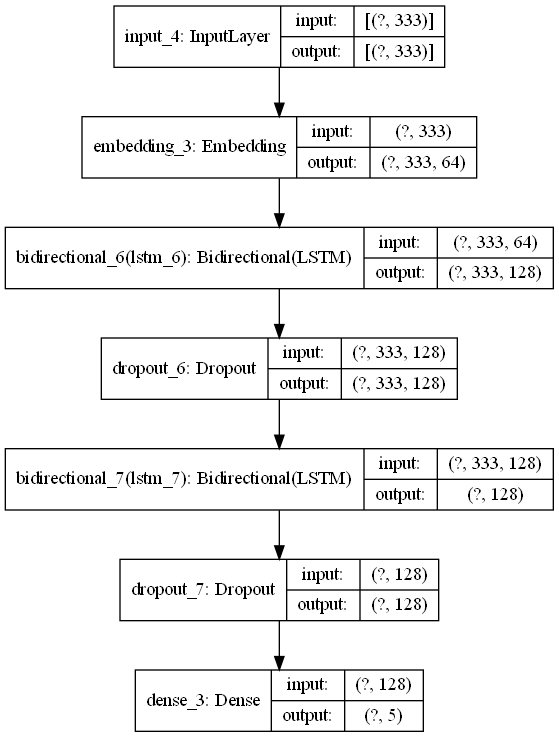
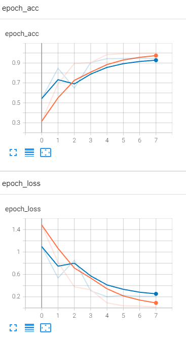
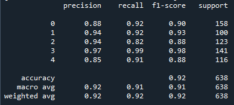
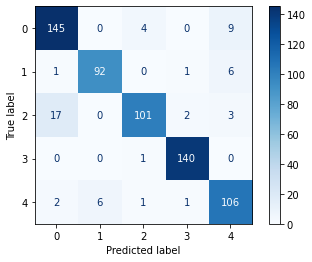

# Text Classification using LSTM

The purpose of this project is to build a model for text classification using Long-Short Term Memory (LSTM), a type of recurrent neural network. The dataset provided contains snippets of news articles which has been split into 5 categories - sports, tech, business, entertainment and politics.

## Prerequisites

This script uses the following python libraries:
1. Pandas
2. Numpy
3. Scikit-Learn
4. MatPlotLib
5. Tensorflow

## Model Architecture

The following figure shows the default model architecture used in the script.

EarlyStopping and ModelCheckpoint callbacks have been included to prevent overfitting of the model. Validation loss was used as the monitoring metric.

We are then able to visualise the training and validation metrics using TensorBoard.

With validation loss of 0.20 and validation accuracy of 0.94, the model at Epoch 5 was determined to be the best performing model.

## Model Evaluation

The following figures display how the model performs on testing:

### Classification report

### Confusion matrix

From this, it can be concluded that the model is able to accurately classify the provided data into its appropriate categories and is ready for deployment.

## Credits

Data : [PyCon-Canada-2019-NLP-Tutorial, susanli2016](https://github.com/susanli2016/PyCon-Canada-2019-NLP-Tutorial/blob/master/bbc-text.csv)

Thank you for reading! :sun_with_face:
 
